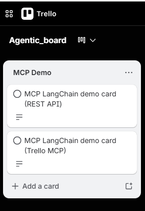
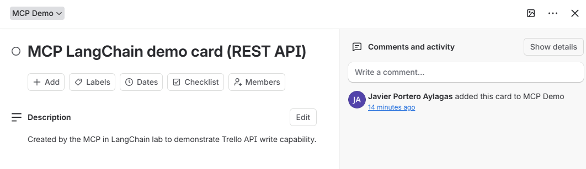
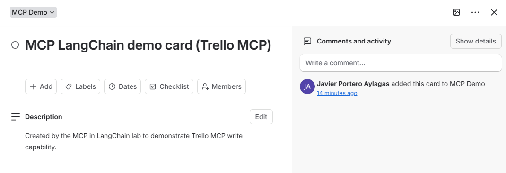

# LangChain v1 MCP Lab

This project demonstrates how to connect a LangChain v1 agent to MCP servers. The agent uses two MCP servers by default and can optionally compare Trello writes through both MCP and direct REST API calls. Trello is an external app integration for this lab, so use it at your own discretion:

- `filesystem`: reads and lists files from the local `documents/` folder
- `git`: inspects this lab repository by default, or another Git repository if configured in `.env`
- `trello`: optionally uses `@delorenj/mcp-server-trello` through MCP to create one real demo card
- `trello REST API`: optionally uses official Trello REST endpoints to create one real demo card

The lab follows the current LangChain v1 style with `create_agent` and `MultiServerMCPClient.get_tools()`.

No mock Git or Trello service is implemented. Git is required and fails early if no valid repository is available. Trello is optional; when its environment variables are missing, the Trello demo is skipped, and when they are present, the script writes to real Trello resources with the configured credentials.

## What This Lab Proves

This project satisfies the main lab goals:

1. Connect to MCP servers from Python.
2. Load MCP tools into LangChain.
3. Create a LangChain v1 agent.
4. Use filesystem MCP tools to inspect and read local documents.
5. Use Git MCP tools to inspect repository status.
6. Optionally compare a third-party Trello MCP server with direct official Trello REST API calls.
7. Check MCP resources and explain when none are exposed by the selected servers.

## Files

- `mcp_langchain.py`: main Python script for the MCP-enabled LangChain agent
- `documents/filesystem_mcp_demo.txt`: small lab fixture used to prove the filesystem MCP server can read real files
- `documents/assets/trello/`: Trello screenshots embedded in this README
- `requirements.txt`: Python dependencies
- `lab_summary.md`: short MCP vs direct API comparison
- `demo_output.txt`: optional file where terminal output can be saved after running the script
- `Lab_source/`: original saved lab instructions

The `documents/` folder is intentionally used as the filesystem MCP sandbox. The filesystem server is only allowed to read inside this folder, so `filesystem_mcp_demo.txt` gives the agent a safe file to list, read, and summarize during the lab. The Trello screenshots also live under `documents/assets/` so the repository has one content folder instead of both `documents/` and `docs/`.

## How It Works

The script creates one `MultiServerMCPClient` with two required MCP server configurations and one optional Trello MCP server configuration:

- The filesystem server is started with `npx -y @modelcontextprotocol/server-filesystem documents/`.
- The Git server is started with `python -m mcp_server_git --repository <repo_path>`.
- If Trello credentials are configured, the third-party Trello MCP server is started with `npx -y @delorenj/mcp-server-trello`.

After the MCP servers start, LangChain loads their tools with:

```python
tools = await client.get_tools()
```

Those tools are passed into a LangChain v1 agent:

```python
agent = create_agent(model_name, tools, system_prompt=...)
```

The agent can then decide when to call filesystem, Git, or Trello MCP tools to answer user questions.

If Trello credentials are configured, the script also calls the official Trello REST API directly. This creates a side-by-side comparison:

- REST API path: explicit Python HTTP calls to official Trello endpoints.
- MCP path: LangChain tool calls exposed by the third-party `@delorenj/mcp-server-trello` package.

Trello does not currently provide an official Trello-specific MCP server. The Trello MCP comparison uses this third-party package:

- `@delorenj/mcp-server-trello`: https://github.com/delorenj/mcp-server-trello

The REST API comparison uses these official Trello endpoints:

- `GET /1/boards/{board_id}/lists`
- `POST /1/lists`
- `POST /1/cards`

## Setup

Use Python 3.10 or newer.

```bash
python -m venv .venv
source .venv/bin/activate
pip install -r requirements.txt
```

The filesystem MCP server runs through `npx`, so Node.js must also be installed.

Create a `.env` file with your OpenAI API key:

```bash
OPENAI_API_KEY=your_openai_api_key_here
OPENAI_MODEL=openai:gpt-4o-mini
```

`MCP_GIT_REPOSITORY` is optional. If it is not set, the script dynamically uses this lab folder as the Git repository. The script intentionally fails fast if neither this lab folder nor the configured path is a valid Git repository, because the Git MCP server cannot start without a real repository.

If this lab folder is not already a Git repository, initialize it:

```bash
git init
git add .
git commit -m "Initial MCP LangChain lab"
```

Then set:

```bash
MCP_GIT_REPOSITORY=/absolute/path/to/another/git/repository
```

If Git says your name or email is missing:

```bash
git config user.name "Your Name"
git config user.email "you@example.com"
```

## Optional Trello Comparison Setup

Trello is disabled unless the API key, token, and board ID are present in `.env`. This keeps the filesystem and Git lab demos runnable without Trello.

There is no mocked Trello mode. If Trello is configured, the script creates real Trello cards on the configured board/list. If Trello is not configured, the Trello comparison is skipped.

Trello is a third-party app outside this lab, and the Trello MCP server used here is also third-party. Enabling this demo gives both the direct REST API code and the Trello MCP server a write-capable Trello token, so use it at your own discretion. Recommended practice:

- use an empty test board only
- create a token only for this lab
- do not use company, client, or personal production boards
- revoke the token after the demo
- keep `.env` out of git
- prefer the optional `TRELLO_LIST_ID` only when you intentionally want to write to a known existing list

```bash
TRELLO_API_KEY=your_trello_api_key_here
TRELLO_TOKEN=your_trello_token_here
TRELLO_BOARD_ID=your_trello_board_id_here
```

When these values are set, the script creates or reuses a demo list on the configured board. Both comparison paths write to that same list:

```bash
TRELLO_LIST_NAME=MCP Demo
```

`TRELLO_LIST_NAME` is optional and defaults to `MCP Demo`. If you already have a specific target list, you can bypass dynamic list creation:

```bash
TRELLO_LIST_ID=your_trello_list_id_here
```

The comparison demo creates two real Trello cards:

- list: `TRELLO_LIST_NAME` when `TRELLO_LIST_ID` is not set
- REST API card: `MCP LangChain demo card (REST API)`
- Trello MCP card: `MCP LangChain demo card (Trello MCP)`
- target list: `TRELLO_LIST_ID`, or the dynamically created/reused demo list

Example Trello output from the comparison demo:



REST API-created card:



Trello MCP-created card:



Get a Trello API key from https://trello.com/app-key. Generate a token from that API key with read/write scope, for example by visiting:

```text
https://trello.com/1/authorize?expiration=never&name=MCP%20LangChain%20Lab&scope=read,write&response_type=token&key=YOUR_API_KEY
```

Replace `YOUR_API_KEY` with your actual key. Use the board ID from the Trello board URL. Keep these values in `.env`; the script reports missing Trello variable names, but never prints Trello secret values.

## Run

```bash
python mcp_langchain.py
```

To save proof of the run:

```bash
python mcp_langchain.py > demo_output.txt
```

## Expected Output

When the script works, you should see:

- a message saying the Trello comparison demo was skipped, or a message saying it is configured
- a connection message for filesystem/Git, plus Trello when configured
- a list of loaded tools, including names like `filesystem_list_directory`, `git_git_status`, and Trello tools when configured
- an answer listing files in `documents/`
- an answer summarizing `filesystem_mcp_demo.txt`
- an answer describing the Git repository status
- when Trello is configured, output confirming one REST API card and one Trello MCP card

Note: the configured MCP servers mainly expose tools. The script also calls `get_resources()` and prints any resources exposed by the configured servers. If no resources appear, that is a property of these servers, not a LangChain error.

## Troubleshooting

### `OPENAI_API_KEY is not set`

Create a `.env` file or export the key in your terminal:

```bash
export OPENAI_API_KEY=your_openai_api_key_here
```

### `model_not_found` or `does not have access to model`

Your OpenAI project does not have access to the configured model. This project defaults to:

```bash
OPENAI_MODEL=openai:gpt-4o-mini
```

Use another model only if your OpenAI project has access to it.

### `No Git repository is configured`

The Git MCP server requires a real Git repository. Run:

```bash
git init
git add .
git commit -m "Initial MCP LangChain lab"
```

### `Client does not support MCP Roots`

This is an informational message from the filesystem MCP server. The script passes the allowed directory directly as a server argument, so this message is expected and not an error.

### `Could not load resources from these servers`

The selected filesystem and Git MCP servers mainly expose tools. This message does not stop the tool-based demo from working.

### `Trello comparison demo skipped`

This is expected unless you want to run the optional Trello write demo. Set `TRELLO_API_KEY`, `TRELLO_TOKEN`, and `TRELLO_BOARD_ID` in `.env` to enable it. `TRELLO_LIST_ID` is optional.

## References

- LangChain Python MCP docs: https://docs.langchain.com/oss/python/langchain/mcp
- LangChain MCP adapters reference: https://reference.langchain.com/python/langchain-mcp-adapters/client/MultiServerMCPClient
- MCP reference servers: https://github.com/modelcontextprotocol/servers
- Third-party Trello MCP package used for comparison: https://github.com/delorenj/mcp-server-trello
- Trello REST API introduction: https://developer.atlassian.com/cloud/trello/guides/rest-api/api-introduction/
- Trello lists API: https://developer.atlassian.com/cloud/trello/rest/api-group-lists/
- Trello cards API: https://developer.atlassian.com/cloud/trello/rest/api-group-cards/
